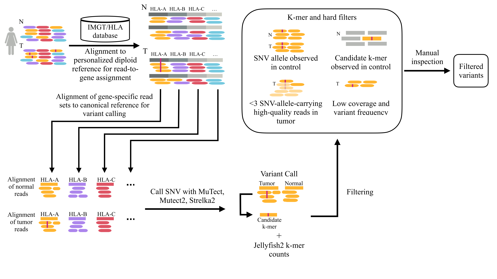

# aCaHLA - Variant Calling in the HLA region on Illumina Amplicon Sequencing Data
[](https://doi.org/10.5281/zenodo.11061968)

# Abstract
Immune evasion is a hallmark of gliomas, yet the genetic mechanisms by which tumors escape immune surveillance remain incompletely understood. In this study, we systematically examined the presence of somatic mutations in HLA genes and genes encoding proteins involved in antigen presentation across isocitrate dehydrogenase wild-type and mutant gliomas using targeted next-generation sequencing. To address the challenges associated with detecting somatic mutations in these highly polymorphic and complex regions of the genome, we applied a combination of short-read and long-read sequencing techniques, extended the genetic region of interest (exons and introns), and applied a tailored bioinformatics analysis pipeline, which enabled an accurate evaluation of comprehensive sequencing data. Our analysis identified mutations in HLA class II and nonclassic HLA genes as well as genes associated with antigen presentation, such as TAP1/2 and B2M. Three-dimensional modeling of individual mutations simulated the potential impact of somatic mutations in TAP1 and B2M on the encoded protein configuration. The presence of somatic mutations supports the role of antigen-presenting genes in the pathophysiology and potential immune escape of gliomas. Our data demonstrated an increased frequency of such mutations in recurrent glioblastoma, potentially resulting from a positive selection or mutagenic enrichment of tumor cells during tumor progression. Taken together, this research generates new insights and hypotheses for the functional analysis and optimization of immunotherapy strategies for gliomas, which may guide personalized treatment paradigms.



# Pipeline Execution
### Data
As input, the pipeline requires paired-end Illumina amplicon fastq files, personalized reference fasta files containing the individual HLA references, and the GRCh38 reference. A generated test sample and necessary reference data can be found [here](https://doi.org/10.5281/zenodo.11061968).

We provide the HLA sequences of genes in which mutations were identified. We reserve the right to disclose additional data only upon request and with appropriate justification, in order to protect patient privacy. The Illumina sequencing data is available at SRA accession [PRJNA1192288](https://dataview.ncbi.nlm.nih.gov/object/PRJNA1192288). The corresponding nanopore alignment files used for validation, along with the corresponding reference files, are available at SRA accession [PRJNA1198493](https://www.ncbi.nlm.nih.gov/sra/PRJNA1198493). (Note: Once our manuscript is published, the data will be accessible under the given links.)

### Preparation
This pipeline is based on the Snakemake workflow and management system and uses conda to automatically deploy the required software. Make sure to have [conda](https://conda.io/projects/conda/en/latest/user-guide/install/index.html) installed. Start with creating an environment for the pipeline execution by running the following commands:

```
conda env create -f environment.yaml
conda activate vacahla
```
We use three variant callers, amongst others MuTect, which we run in a singularity container. This must be considered when running the pipeline. Make sure to have singularity installed (requires Linux or Linux VM).

Use the [config file](SnakemakePipeline/envs/config.yaml) to adjust parameters for your execution. The pipeline requires normal and tumor fastq samples and reference sequences as input.  It follows an explanation of the input parameters:

- **prefix**: used as prefix of personal reference fasta files
- **idMapping**: tab separated file listing the tumor ID and normal ID of the read files for each patient in a new line
- **path**: path for input and output;  must contain the folders "healthySamples" and "tumorSamples", containing the normal and tumor fastq files and a subfolder "personalReferences" for the normal data and tumor data, respectively
- **referenceFolder**: subfolder in the previous folders containing personalized references
- **hg38path**: path to the reference sequences contained in GRCh38 of the genes under investigation
- **hg38replaced**: Modified GRCh38 sequence where all target genes (as well as an additional 2000 bases of padding to either side of each gene) is masked with ‘N’ characters and for each target gene, the sequences from the IMGT/HLA database are included
- **sampleGenes**: Genes under investigation
- **prefiltering**: After mapping the reads to personalized references, we filter them. This parameter is used to direct the execution flow of snakemake, such that after filtering the reads are checked for correctness once again.

### Execution
To execute the pipeline use the following command: 

```
snakemake --cores $number$ --use-conda --use-singularity --singularity-args "--bind $HOME"
```

All software requirements are deployed automatically via conda environments.

As output, you get the filtered variant calls as csv files. *False_merged.csv* contains all variant calls from all three variant calling tools that remained after applying our kmer filter. *True_merged.csv* contains the variant calls that were filtered out.

# Please Cite
The VaCaHLA manuscript is published at [Cancer Immunology Research](https://doi.org/10.1158/2326-6066.CIR-24-0419). If you use VaCaHLA for your work, please cite out paper.
```
@article{schulte2025somatic,
  title={Somatic Mutations in HLA Class Genes and Antigen-Presenting Molecules in Malignant Glioma},
  author={Schulte, Sara C and Peter, Wolfgang and Rosenberger, Georg and Sch{\"a}fer, Moritz and Maire, Cecile L and R{\"u}nger, Alessandra and Ryba, Alice and Riecken, Kristoffer and Fita, Krystian D and Matschke, Jakob and others},
  journal={Cancer Immunology Research},
  pages={OF1--OF13},
  year={2025},
  publisher={American Association for Cancer Research}
}
```